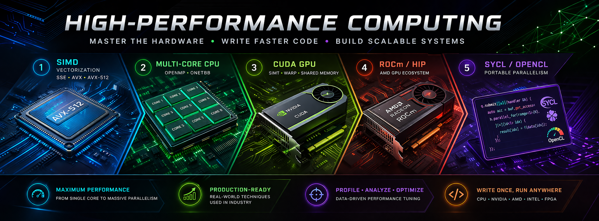

### Chapter 1: C++ and SIMD (Vectorization)
*Goal: Understand how a single CPU core processes multiple data points in one instruction.*

- **Theory:** SIMD basics (SSE, AVX, AVX-512), vector registers, alignment, data swizzling.
- **Compiler Auto-vectorization:** `#pragma omp simd`, `-O3`/`-fast` flags, vectorization reports, why loops fail to vectorize (e.g., pointer aliasing with `__restrict__`).
- **Manual Intrinsics:** `_mm_add_ps`, `_mm_load_ps`, `_mm256_fmadd_ps`, handling masks, horizontal operations.
- **C++ Standard SIMD (C++26 experimental/current):** `std::simd`, `std::simd_mask`, `std::fixed_size` – writing portable vectorized code.
- **Fallbacks:** Loop tiling for cache efficiency, reducing gather/scatter, using `std::assume_aligned`.

### Chapter 2: OpenMP and OneTBB (CPU Multithreading)
*Goal: Distribute work across CPU cores and manage shared memory parallelism.*

- **OpenMP:**
    - Core directives: `parallel for`, `sections`, `single`, `master`, `task`.
    - Data sharing: `shared`, `private`, `firstprivate`, `threadprivate`.
    - Synchronization: `atomic`, `critical`, `barrier`, `reduction`, `ordered`.
    - Scheduling: `static`, `dynamic`, `guided`, `auto`, chunk size tuning.
    - NUMA awareness, nested parallelism, `OMP_PROC_BIND`, `OMP_PLACES`.
- **OneTBB (Threading Building Blocks):**
    - Task-based vs thread-based: `parallel_for`, `parallel_reduce`, `parallel_invoke`.
    - Flow graph: `function_node`, `multifunction_node`, `join`, `split` for pipelines.
    - Concurrent containers: `concurrent_vector`, `concurrent_hash_map`.
    - Scalable memory allocation: `scalable_allocator`, arena partitioning.

### Chapter 3: CUDA and SIMT (Main Focus)
*Goal: Master GPU parallelism – thousands of threads, warp execution, memory hierarchy.*

- **Hardware Model:** SM (Streaming Multiprocessor), warp (32 threads), SIMT vs SIMD, divergence, active mask.
- **Memory Hierarchy:**
    - Global, L2 cache, constant, texture, read-only cache.
    - Shared memory (L1): bank conflicts, padding, `cudaDeviceSetSharedMemConfig`.
    - Registers: spill counts, occupancy calculation, `--ptxas-options=-v`.
    - Unified Memory: `cudaMallocManaged`, page fault migration, prefetching.
- **Kernel design patterns:**
    - Grid-stride loops (for arbitrary problem sizes).
    - Reduction: warp shuffle (`__shfl_xor_sync`), atomics vs shared memory.
    - Matrix multiplication: tiled shared memory, double buffering, vectorized loads (`float4`).
    - Prefix sum (scan): Hillis-Steele, Blelloch, work-efficient decoupled look-back.
- **Advanced CUDA:**
    - Streams & concurrency: `cudaStreamCreate`, default stream blocking, stream priorities.
    - Events & timing: `cudaEventRecord`, `cudaEventSynchronize`.
    - Dynamic parallelism: kernel launches from device.
    - Cooperative groups: `tiled_partition`, grid-level sync (`cudaLaunchCooperativeKernel`).
    - Warp-level primitives: `__match_any_sync`, `__activemask`, ballot.
    - Profiling: Nsight Systems (trace), Nsight Compute (kernel stats: issued vs executed warps, shared replay).
    - Optimization: coalescing, bank conflict elimination, instruction-level parallelism, avoiding serialization (`__syncthreads` inside divergent code).

### Chapter 4: ROCm and HIP (AMD GPU ecosystem)
*Goal: Port CUDA knowledge to AMD hardware with minimal friction.*

- **HIP:** CUDA-like syntax, `hipLaunchKernelGGL`, conversion tool (`hipify-perl`), memory management (`hipMalloc`, `hipMemcpy`).
- **ROCm stack:** ROCclr (runtime), ROCk (kernel driver), ROCm bands (profiler), hipcc compiler.
- **AMD hardware:** Compute Units (CUs), Wavefronts (64 threads vs warps 32), Vector General Purpose Registers (VGPRs), Scalar GPRs.
- **Memory model:** Global memory, LDS (Local Data Share – equivalent to shared memory), bank conflicts on LDS.
- **Performance differences:** No automatic L1 cache for global loads (must use `__builtin_amdgcn_glc`), explicit prefetch.
- **Porting pitfalls:** `__syncthreads` → `__syncthreads` (same), but wavefront divergence cost higher, `__ballot_sync` → `__ballot`.

### Chapter 5: OpenCL and SYCL (Portable Parallelism)
*Goal: Write once, run on CPUs, GPUs, FPGAs, and accelerators.*

- **OpenCL:**
    - Platform & devices, context, command queue, program (SPIR-V compilation), kernel.
    - Buffer abstraction: `CL_MEM_READ_WRITE`, `clEnqueueMapBuffer`, `clEnqueueNDRangeKernel`.
    - Event-based synchronization: `clWaitForEvents`, out-of-order queues.
    - Pain points: Boilerplate code, explicit device memory management.
- **SYCL (higher-level, modern):**
    - Buffer-accessor model: `buffer`, `accessor`, `handler`, `queue.submit`.
    - Unified shared pointers: `malloc_shared`, `free_shared` (similar to CUDA Unified Memory).
    - Kernel styles: basic lambda, `parallel_for` with `range`, `nd_range` (work-group + local memory).
    - Reduction & patterns: `SYCL_EXTERNAL`, `joint_matrix` (for matrix engines).
    - Interop: SYCL-OpenCL, SYCL-CUDA (via Codeplay’s plugins or AdaptiveCpp).
    - Backends: Level Zero (Intel GPUs), CUDA (via plugins), ROCm (via hipsycl).

### Cross-Cutting Practical Skills (Add to any chapter)

- **Performance roofline model:** Compute-bound vs memory-bound, arithmetic intensity.
- **Debugging:** `cuda-gdb`, `roc-gdb`, `ComputeSanitizer` (racecheck, synccheck), `clang` address sanitizer for host.
- **Profiling drills:**
    - CUDA: `nvprof` (legacy), `nsys`, `ncu`.
    - ROCm: `rocprof`, `omniperf`.
    - OpenMP: Intel VTune, perf + `likwid`.
- **Hands-on projects per chapter:**
    1. SIMD: Manual vectorized dot product vs compiler-auto.
    2. OpenMP: Parallel monte carlo pi + TBB flow graph for image pipeline.
    3. CUDA: Tiled matmul → reduction → stencil (Jacobi solver) → convolution (with shared memory & constant cache).
    4. ROCm: Port your CUDA matmul to HIP, measure with `rocprof`.
    5. SYCL: Write one kernel that runs on CPU + Intel GPU + NVIDIA GPU (via plugin).
